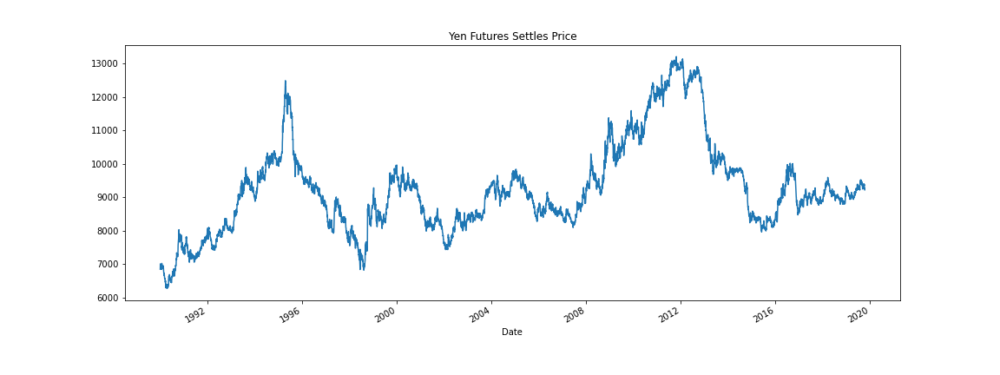
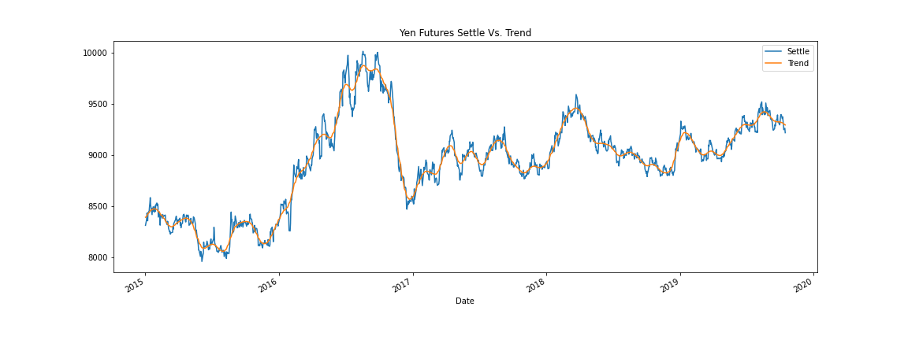
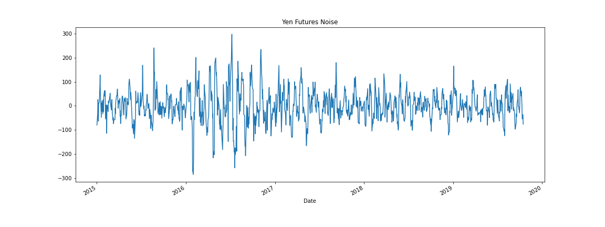
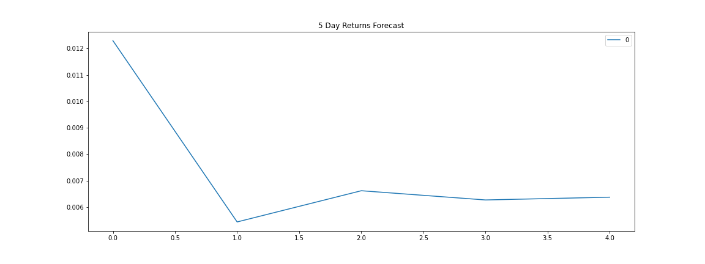
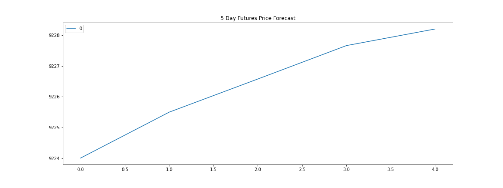
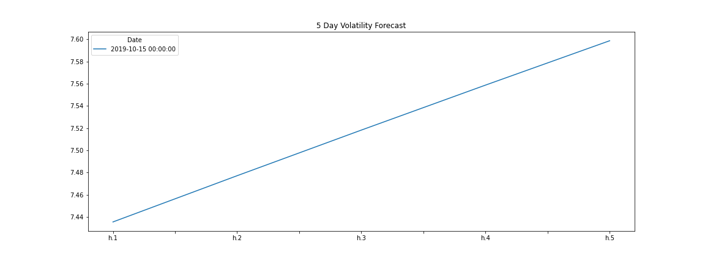
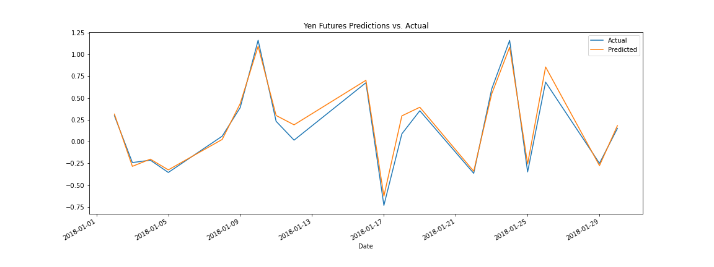
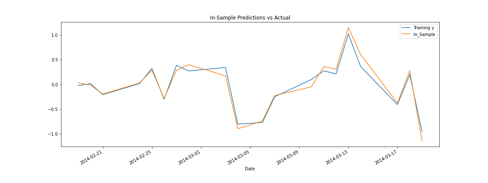

# 💰 💱 💴 Forecasting_Yen_Vs_USD 💴 💱 💰
Time-Series Forecasting and Linear Regression Forecasting of the Japanese Yen to the US Dollar

* [Time_Series_Analysis](https://github.com/BenMcCright/Forecasting_Yen_Vs_USD/blob/master/Notebooks/regression_analysis.ipynb)
* [Regression_Analysis](https://github.com/BenMcCright/Forecasting_Yen_Vs_USD/blob/master/Notebooks/regression_analysis.ipynb)
https://github.com/BenMcCright/Forecasting_Yen_Vs_USD/Notebooks/.git

## Time Series Models

---
## Time Series Conclusions
### I would not buy the Yen right now, but would try to buy the Yen when its actual price is below the trend.
### The risk of the Yen is expected to increase.
### Both the ARMA and ARIMA model do not provide statistically significant insight due to their high p-levels, however the GARCH model has a low enough p-score that it is statistically significant.
---
## Regression Analysis Models

---
## Regression Analysis Conclusions
### The In-Sample predictions and Out-of-Sample predictions are very close to one another, but the In-Sample predictions are slightly more accurate.
---
## Mean Squared Error (MSE)
### - In-Sample = 0.0263
### - Out-of-Sample = 0.0287

## Root Mean Squared Error (RMSE)
### - In-Sample = 0.1622
### - Out-of-Sample = 0.1693